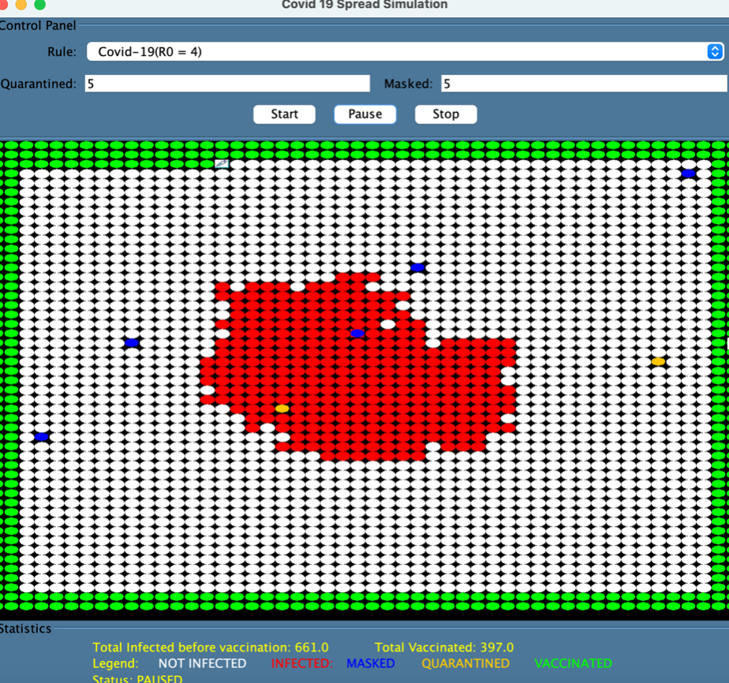

# COVID-19 Spread Simulation INFO 6205 Team 12(Archil Lelashvili, David Nallapu)

Video Presenation : 
OneDrive : <a>https://northeastern-my.sharepoint.com/:v:/r/personal/nallapu_d_northeastern_edu/Documents/presentation.mp4?csf=1&web=1&e=lHUW1C</a>

<!-- GETTING STARTED -->
## Getting Started

To get a local copy up and running, 
1. Clone the git repository. 
2. Install Java
3. Run AppUI.java in edu.neu.csye6200.covid19

To test: 
1. Clone the git repository. 
2. Install Java
3. Run edu.neu.csye6200.covid19_test as Junit 

 

